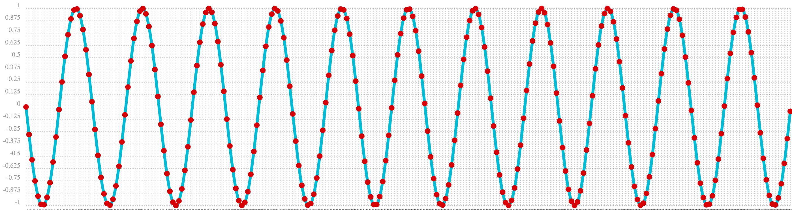

= Digital Signal Processing
// Licensed to the Apache Software Foundation (ASF) under one
// or more contributor license agreements.  See the NOTICE file
// distributed with this work for additional information
// regarding copyright ownership.  The ASF licenses this file
// to you under the Apache License, Version 2.0 (the
// "License"); you may not use this file except in compliance
// with the License.  You may obtain a copy of the License at
//
//   http://www.apache.org/licenses/LICENSE-2.0
//
// Unless required by applicable law or agreed to in writing,
// software distributed under the License is distributed on an
// "AS IS" BASIS, WITHOUT WARRANTIES OR CONDITIONS OF ANY
// KIND, either express or implied.  See the License for the
// specific language governing permissions and limitations
// under the License.

This section of the user guide explores functions that are commonly used in the field of
Digital Signal Processing (DSP).

== Dot product

The `dotProduct` function is used to calculate the dot product of two arrays.
The dot product is the fundamental calculation for the DSP functions discussed in this section. Before diving into
the more complex DSP functions its useful to get an understanding of how the dot product calculation works.

=== Combining two arrays

The `dotProduct` function can be used to combine two arrays into a single product. A simple example can help
illustrate this concept.

In the example below two arrays are set to variables *a* and *b* and then operated on by the `dotProduct` function.
The outout of the `dotProduct` function is set to variable *c*.

Then the `mean` function is then used to compute the mean of the first array which is set to the variable `d`.

Both the dot product and the mean are included in the output.

When we look at the output of this expression we see that the *dot product* and the *mean* of the first array
are both 30.

The dot product function calculated the mean of the first array.

[source,text]
----
let(echo="c, d",
    a=array(10, 20, 30, 40, 50),
    b=array(.2, .2, .2, .2, .2),
    c=dotProduct(a, b),
    d=mean(a))
----

When this expression is sent to the /stream handler it responds with:

[source,json]
----
{
  "result-set": {
    "docs": [
      {
        "c": 30,
        "d": 30
      },
      {
        "EOF": true,
        "RESPONSE_TIME": 0
      }
    ]
  }
}
----

To get a better understanding of how the dot product calculated the mean we can perform the steps of the
calculation using vector math and look at the output of each step.

In the example below the `ebeMultiply` function performs an element-by-element multiplication of
two arrays. This is the first step of the dot product calculation. The result of the element-by-element
multiplication is assigned to variable *c*.

In the next step the `add` function adds all the elements of the array in variable *c*.

Notice that multiplying each element of the first array by .2 and then adding the results is
equivalent to the formula for computing the mean of the first array. The formula for computing the mean
of an array is to add all the elements and divide by the number of elements.

[source,text]
----
let(echo="c, d",
    a=array(10, 20, 30, 40, 50),
    b=array(.2, .2, .2, .2, .2),
    c=ebeMultiply(a, b),
    d=add(c))
----

When this expression is sent to the /stream handler it responds with:

[source,json]
----
{
  "result-set": {
    "docs": [
      {
        "c": [
          2,
          4,
          6,
          8,
          10
        ],
        "d": 30
      },
      {
        "EOF": true,
        "RESPONSE_TIME": 0
      }
    ]
  }
}
----

In the example above two arrays were combined in a way that produced the mean of the first. In the second array
each value was set to .2. Another way of looking at this is that each value has the same weight. By varying the weights
in the second array we can produce a different result. For example if the first array represents a time series, the weights
in the second array can be set to add more weight to a particular element in the first array.

The example below creates a weighted average with the weight decreasing from right to left. Notice that the weighted mean
of 36.666 is larger the previous mean which was 30. This is because more weighted was given to last element in the
array.

[source,text]
----
let(echo="c, d",
    a=array(10, 20, 30, 40, 50),
    b=array(.066666666666666,.133333333333333,.2, .266666666666666, .33333333333333),
    c=ebeMultiply(a, b),
    d=add(c))
----

When this expression is sent to the /stream handler it responds with:

[source,json]
----
{
  "result-set": {
    "docs": [
      {
        "c": [
          0.66666666666666,
          2.66666666666666,
          6,
          10.66666666666664,
          16.6666666666665
        ],
        "d": 36.66666666666646
      },
      {
        "EOF": true,
        "RESPONSE_TIME": 0
      }
    ]
  }
}
----

=== Representing Correlation

Often when we think of correlation, we are thinking of *Pearsons* correlation in the field of statistics. But the definition of
correlation is actually more general: a mutual relationship or connection between two or more things.
In the field of digital signal processing the dot product is used to represent correlation. The examples below demonstrates
how the dot product can be used to represent correlation.

In the example below the dot product is computed for two vectors. Notice that the vectors have different values that fluctuate
together. The output of the dot product is 190, which is hard to reason about because because its not scaled.

[source,text]
----
let(echo="c, d",
    a=array(10, 20, 30, 20, 10),
    b=array(1, 2, 3, 2, 1),
    c=dotProduct(a, b))
----

When this expression is sent to the /stream handler it responds with:

[source,json]
----
{
  "result-set": {
    "docs": [
      {
        "c": 190
      },
      {
        "EOF": true,
        "RESPONSE_TIME": 0
      }
    ]
  }
}
----

One approach to scaling the dot product is to first scale the vectors so that both vectors have a magnitude of 1. Vectors with a
magnitude of 1, also called unit vectors, are used when comparing only the angle between vectors rather then the magnitude.
The `unitize` function can be used to unitize the vectors before calculating the dot product.

Notice in the example below the dot product result, set to variable *e*, is effectively 1. When applied to unit vectors the dot product
will be scaled between 1 and -1. Also notice in the example `cosineSimilarity` is calculated on the *unscaled* vectors and the
answer is also effectively 1. This is because *cosine similarity* is the scaled *dot product*.

[source,text]
----
let(echo="e, f",
    a=array(10, 20, 30, 20, 10),
    b=array(1, 2, 3, 2, 1),
    c=unitize(a),
    d=unitize(b),
    e=dotProduct(c, d),
    f=cosineSimilarity(a, b))
----

When this expression is sent to the /stream handler it responds with:

[source,json]
----
{
  "result-set": {
    "docs": [
      {
        "e": 0.9999999999999998,
        "f": 0.9999999999999999
      },
      {
        "EOF": true,
        "RESPONSE_TIME": 0
      }
    ]
  }
}
----

If we transpose the first two numbers in the first array, so that the vectors
are not perfectly correlated, we see that the cosine similarity drops. This illustrates
how the dot product represents correlation.

[source,text]
----
let(echo="c, d",
    a=array(20, 10, 30, 20, 10),
    b=array(1, 2, 3, 2, 1),
    c=cosineSimilarity(a, b))
----

When this expression is sent to the /stream handler it responds with:

[source,json]
----
{
  "result-set": {
    "docs": [
      {
        "c": 0.9473684210526314
      },
      {
        "EOF": true,
        "RESPONSE_TIME": 0
      }
    ]
  }
}
----

== Convolution

The `conv` function calculates the convolution of two vectors. The convolution is calculated by *reversing*
the second vector and sliding it across the first vector. The *dot product* of the two vectors
is calculated at each point as the second vector is slid across the first vector.
The dot products are collected in the *third vector* which is the *convolution* of the two vectors.

=== Moving Average

Before looking at an example of convolution its useful to review the `movingAvg` function. The moving average
function computes a moving average by sliding a window across a vector and computing
the average of the window at each shift. If that sounds similar to convolution, that's because the `movingAvg` function
is syntactic sugar for convolution.

Below is an example of a moving average with a window size of 5. Notice that original vector had 13 elements
but the result of the moving average has only 9 elements. This is because the `movingAvg` function
only begins generating results when it has a full window. In this case because the window size is 5 so the
moving average starts generating results from the 4th index of the original array, which is the value 5.

[source,text]
----
let(a=array(1, 2, 3, 4, 5, 6, 7, 6, 5, 4, 3, 2, 1),
    b=movingAvg(a, 5))
----

When this expression is sent to the /stream handler it responds with:

[source,json]
----
{
  "result-set": {
    "docs": [
      {
        "b": [
          3,
          4,
          5,
          5.6,
          5.8,
          5.6,
          5,
          4,
          3
        ]
      },
      {
        "EOF": true,
        "RESPONSE_TIME": 0
      }
    ]
  }
}
----

=== Convolutional Smoothing

The moving average can also be computed with convolutional math. In the example
below the `conv` function is used to compute the moving average of the first array
by applying the second array as the weighted filter.

Looking at the result, we see that it is not exactly the same as the result
of the `movingAvg` function. That is because the `conv` effectively pads zeros
to the front and back of the first vector so that the window size is always full.
It is useful to think of the first vector as:

[source,text]
----
0, 0, 0, 0, 1, 2, 3, 4, 5, 6, 7, 6, 5, 4, 3, 2, 1, 0, 0, 0, 0
----

[source,text]
----
let(a=array(1, 2, 3, 4, 5, 6, 7, 6, 5, 4, 3, 2, 1),
    b=array(.2, .2, .2, .2, .2),
    c=conv(a, b))
----

When this expression is sent to the /stream handler it responds with:

[source,json]
----
{
  "result-set": {
    "docs": [
      {
        "c": [
          0.2,
          0.6000000000000001,
          1.2,
          2.0000000000000004,
          3.0000000000000004,
          4,
          5,
          5.6000000000000005,
          5.800000000000001,
          5.6000000000000005,
          5.000000000000001,
          4,
          3,
          2,
          1.2000000000000002,
          0.6000000000000001,
          0.2
        ]
      },
      {
        "EOF": true,
        "RESPONSE_TIME": 0
      }
    ]
  }
}
----

We can clean up the result by using the `copyOfRange` function to copy a range of the result that drops the first and last 4 values of
the convolution result. In the example below the `precision` function is also also used to remove floating point errors from the
convolution result. When this is done the output is exactly the same as the `movingAvg` function.

[source,text]
----
let(a=array(1, 2, 3, 4, 5, 6, 7, 6, 5, 4, 3, 2, 1),
    b=array(.2, .2, .2, .2, .2),
    c=conv(a, b),
    d=copyOfRange(c, 4, 13),
    e=precision(d, 2))
----

When this expression is sent to the /stream handler it responds with:

[source,json]
----
{
  "result-set": {
    "docs": [
      {
        "e": [
          3,
          4,
          5,
          5.6,
          5.8,
          5.6,
          5,
          4,
          3
        ]
      },
      {
        "EOF": true,
        "RESPONSE_TIME": 0
      }
    ]
  }
}
----

== Cross-Correlation

Cross-correlation is used to determine the delay between two signals. This is accomplished by sliding one signal across another
and calculating the dot product at each shift. The dot products are collected into a vector which represents the correlation
at each shift. The highest dot product in the cross-correlation vector is the point where the two signals are most closely correlated.

The sliding dot product used in convolution can also be used to represent cross-correlation between two vectors. The only
difference in the formula when representing correlation is that the second vector is *not reversed*.

Notice in the example below that the second vector is reversed by the `rev` function before it is operated on by the `conv`.
The `conv` function reverses the second vector so it will be flipped back to its original order to perform the correlation calculation
rather then the convolution calculation.

Notice in the result the highest value is 217. This is the point where the two vectors have the highest correlation.

[source,text]
----
let(a=array(1, 2, 3, 4, 5, 6, 7, 6, 5, 4, 3, 2, 1),
    b=array(4, 5, 6, 7, 6, 5, 4, 3, 2, 1),
    c=conv(a, rev(b)))
----

When this expression is sent to the /stream handler it responds with:

[source,json]
----
{
  "result-set": {
    "docs": [
      {
        "c": [
          1,
          4,
          10,
          20,
          35,
          56,
          84,
          116,
          149,
          180,
          203,
          216,
          217,
          204,
          180,
          148,
          111,
          78,
          50,
          28,
          13,
          4
        ]
      },
      {
        "EOF": true,
        "RESPONSE_TIME": 0
      }
    ]
  }
}
----

== Find Delay

It is fairly simple to compute the delay from the cross-correlation result, but a convenience function called `finddelay` can
be used to find the delay. Under the covers the `finddelay` uses convolutional math to compute the cross-correlation vector
and then computes the delay between the two signals.

Below is an example of the `finddelay` function. Notice that the `finddelay` function reports a 3 period delay between the first
and second signal.

[source,text]
----
let(a=array(1, 2, 3, 4, 5, 6, 7, 6, 5, 4, 3, 2, 1),
    b=array(4, 5, 6, 7, 6, 5, 4, 3, 2, 1),
    c=finddelay(a, b))
----

When this expression is sent to the /stream handler it responds with:

[source,json]
----
{
  "result-set": {
    "docs": [
      {
        "c": 3
      },
      {
        "EOF": true,
        "RESPONSE_TIME": 0
      }
    ]
  }
}
----

== Auto-Correlation

Auto-correlation measures the degree to which a signal is correlated with itself. Auto-correlation is used to determine
if a vector contains a signal or is purely random.

A few examples with plots will help to understand the concepts.

In the first example `sin` function is wrapped around a `sequence` function to generate sine wave. The result of this
can is plotted in the image below. Notice that there is a very clear structure to plot that is clearly not random.

[source,text]
----
sin(sequence(256, 0, 6)
----

== Discrete Fourier Transform